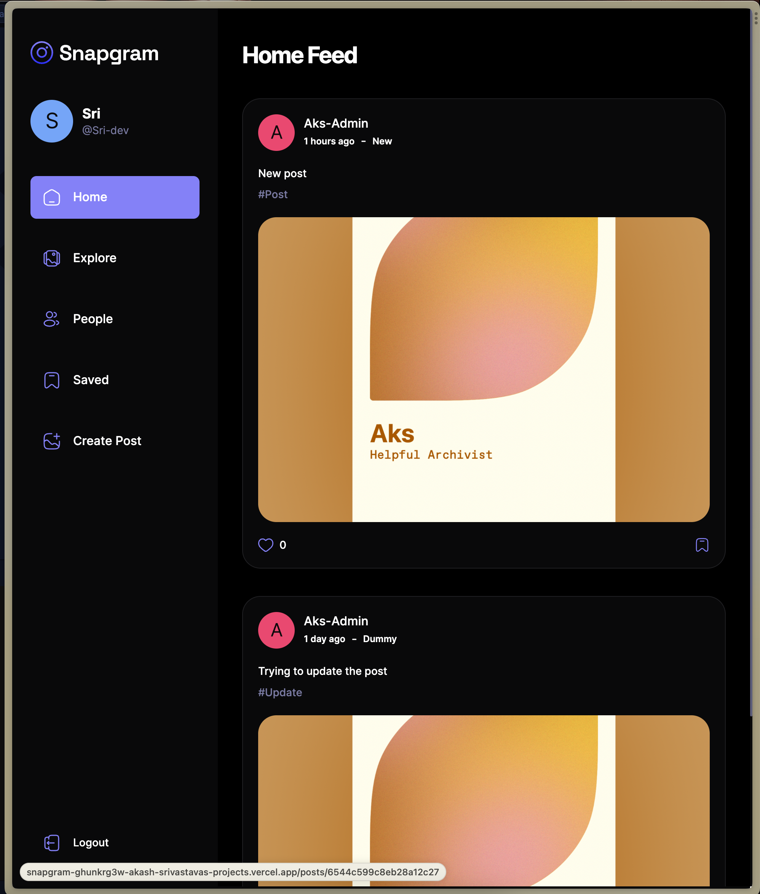
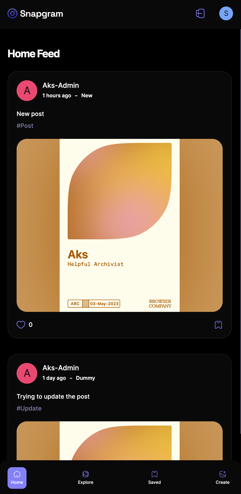

## SnapGram App

A webapp where the users can add posts, likes and save the posts of their choice and much more...

Have a look at a minimal deployed version of the app at **[Snapgram](https://snapgram-ghunkrg3w-akash-srivastavas-projects.vercel.app)** 😆

## Screenshots

  
  

## Project:

It is built using React, TypeScript and Vite.

### Tech stack used to build the project:

- React
- TanStack Query
- Appwrite(as BaaS)
